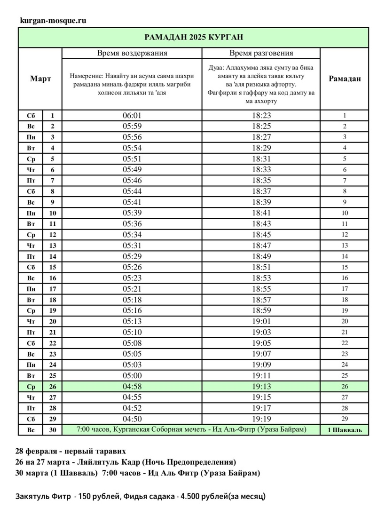
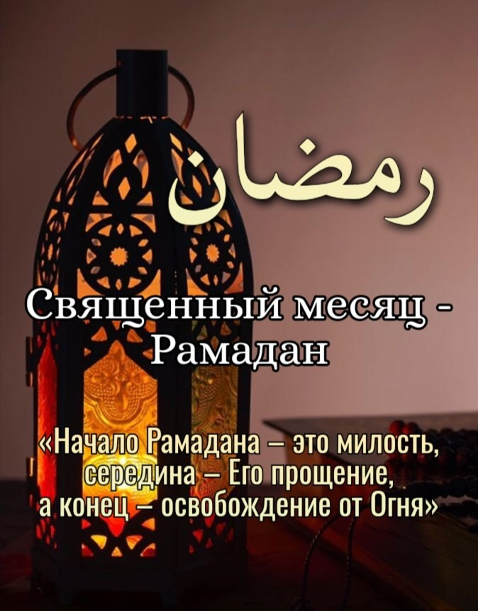
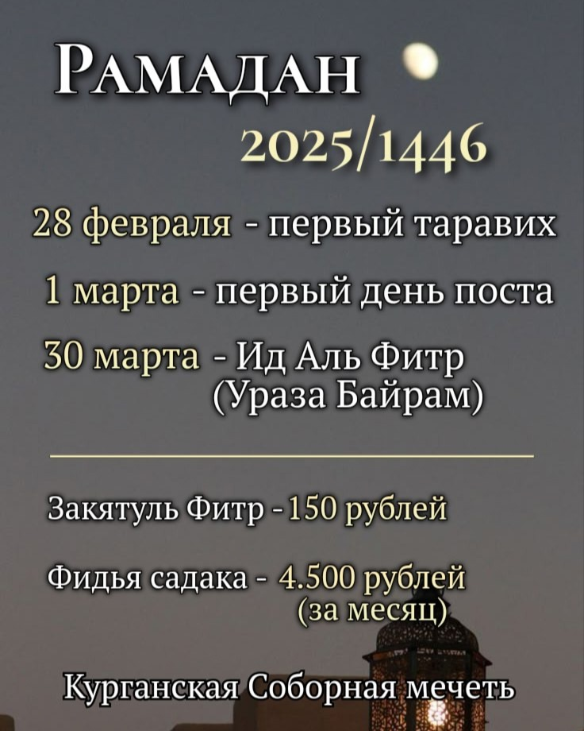
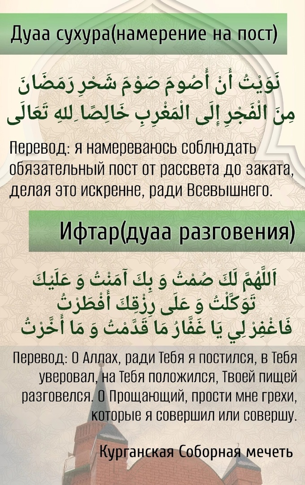
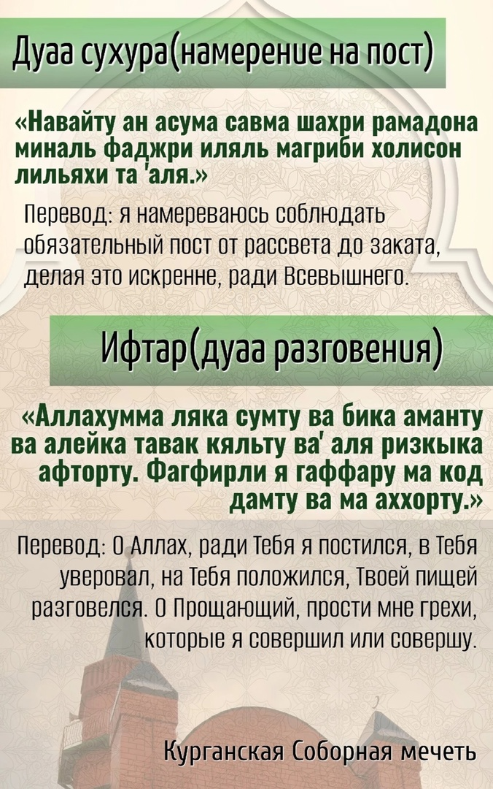
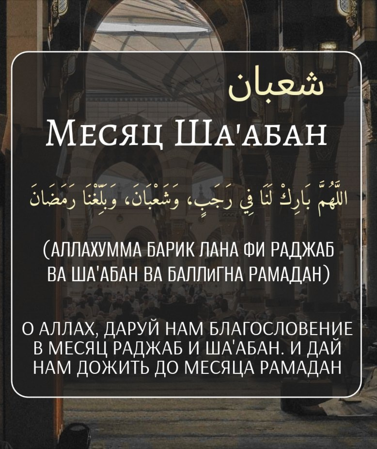
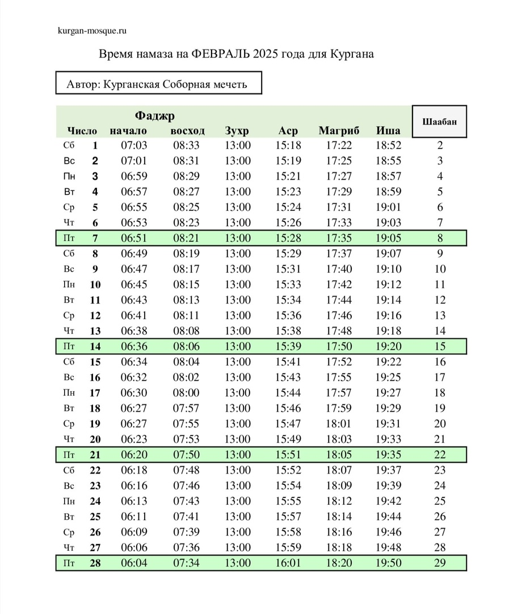

### Обращение председателя КГРОМ по случаю наступления Священного месяца Рамадан.

بسم الله الرحمن الرحيم

السلام عليكم ورحمة الله وبركاته

Приветствие и благословение Аллаха Пророку Мухаммадуﷺ, его семье, сподвижникам и всем тем кто следует его призыву до Судного дня.

Уважаемые братья и сестры! Поздравляю вас с наступлением Священного месяца - Рамадан.

28 февраля с заходом солнца, для всех мусульман начнётся месяц Рамадан - месяц, который с нетерпением ждут миллиарды мусульман во всем мире.

Этот месяц пропитан духовностью и благами от Аллаха, и сердце каждого мусульманина испытывает в это время духовный подьем, что является бесспорным признаком наличия у человека искренней веры.

Осталось совсем мало времени до Священного месяца. Поэтому, давайте искренне обратимся к Аллаху с покаянием и просьбой о прощении наших прежних грехов. Начав месяц с духовной чистотой, мы сможем извлечь максимальную пользу от Рамадана.

Аллах Субханаху Ва Та'аля говорит в Священном Кур'ане:

شَهْرُ رَمَضَانَ ٱلَّذِىٓ أُنزِلَ فِيهِ ٱلْقُرْآنُ هُدًى لِّلنَّاسِ وَبَيِّنَٰتٍ مِّنَ ٱلْهُدَىٰ وَٱلْفُرْقَانِ

«В месяц Рамадан был ниспослан Коран - верное руководство для людей, ясные доказательства верного руководства и различение» сура Аль-Бакара,185 аят.

Рамадан - это время, когда раб становится еще ближе к Своему Творцу, двери милости Аллаха открываются еще шире, грехи прощаются, а поклонение и благое обретает еще большую награду.

В хадисе, от Абу Хурайры сообщается, что Посланник Аллахаﷺ сказал: «Кто постился в Рамадан с верой и надеждой на награду от Аллаха, тому простятся его прошлые грехи».

От ‘Абдуллаха ибн Амра ибн Аль-‘асса (да будет доволен ими обоими Аллах) передаётся, что Посланник Аллахаﷺсказал:

الصِّيَامُ وَالْقُرْآنُ يَشْفَعَانِ لِلْعَبْدِ يَوْمَ الْقِيَامَةِ، يَقُولُ الصِّيَامُ: أَيْ رَبِّ، مَنَعْتُهُ الطَّعَامَ وَالشَّهَوَاتِ بِالنَّهَارِ، فَشَفِّعْنِي فِيهِ، وَيَقُولُ الْقُرْآنُ: مَنَعْتُهُ النَّوْمَ بِاللَّيْلِ، فَشَفِّعْنِي فِيهِ ، قَالَ: فَيُشَفَّعَانِ

«Пост и Коран будут заступаться за раба Аллаха в Судный день. Пост скажет: "О мой Господь! Я лишил его еды и страстей днём, так позволь же мне заступиться за него". Коран скажет: "О мой Господь! Я лишил его сна ночью, так позволь же мне заступиться за него". И тогда они оба заступятся за этого раба». (Имам Ахмад)

Сообщается со слов Абу Хурайры, да будет доволен им Аллах, что Посланник Аллахаﷺ сказал: «Когда наступает месяц Рамадан, райские врата
открываются, а врата Ада запираются, и шайтаны сковываются цепями».

В первую ночь этого благословенного месяца я хочу призвать всех мусульман простить друг другу все обиды, очистить свои сердца от зависти и всего дурного, искренне и от всей души вознамериться заслужить довольство Аллаха посредством поста, поклонения, милостыни и благородных поступков.

Смысл Рамадана не в том, чтобы воздержаться от еды и питья в дневное время. Его смысл в том, чтобы посредством поста, поклонения и отказа от всего пагубного и греховного очиститься перед Аллахом и заслужить Его милость. Всевышний не оставляет без ответа того, кто поступает согласно Его мудрым велениям и сторонится всего плохого. И если Аллах дарует человеку успех в этом месяце, то в действительности именно он является богатым человеком.

Я сердечно поздравляю всех мусульман с началом Священного месяца Рамадан.

Пусть Всевышний ниспошлёт вам свою милость и милосердие.

Прошу Аллаха укрепить наши сердца, даровать нам терпение и стойкость, спокойствие и благополучие.

Да поможет нам Аллах, и да сделает Он этот Рамадан - средством наставления нас на прямой путь.

Пусть этот Рамадан наполнит наши дома - верой, наши сердца - богобоязненностью, наши души - искренним светом имана.

Пусть этот Рамадан принесёт мир и покой, о которых вызывают наши души,

Пусть этот Рамадан унесёт все наши печали и нашу боль,

Пусть этот Рамадан укрепит наши отношения с родными и близкими,

Пусть этот Рамадан исцелит наши сердца,

Пусть этот Рамадан укрепит наш иман,

Пусть этот Рамадан приблизит нас к Аллаху,

Пусть в этом Рамадан Всевышний ответит на все наши дуаа.

#### Также напоминаю, что каждую ночь месяца Рамадан в Курганской Соборной мечети будет проводиться коллективная молитва Таравих, по адресу Сибирская, 2А.

Да пребудет над вами мир милость и Благославение Аллаха.
С уважением и добрыми молитвами, Председатель Курганской городской религиозной организации мусульман Зиёдали Хаджи Мизробов.

---
Ассаляму алейкум ва рахматуллахи ва баракятух братья и сестры, до начала Рамадана остались считанные дни.
Еще один Рамадан в нашей жизни. Это действительно огромная милость — застать этот Священный месяц и, что важнее, возможность соблюдать пост.

Сколько из тех, кто постился с нами в прошлом году, не смогут делать это сейчас по разным причинам, и сколько людей мечтали дожить до этого месяца, но Аллах забрал их к Себе. Это заставляет нас думать о ценности каждой секунды.

Милость Аллаха безгранична, и тот, кто доживет до этого месяца, — это тот, над кем Он смилостивился, даровав ему еще один шанс стать лучше, приблизиться к Нему, укрепить свою веру и связь с Кораном.

اللَّهُمَّ سَلِّمْنَا لِرَمَضَانَ وَسَلِّمَ رَمَضَانَ لَنَا مُتَقَبَّلًا

О, Аллах, сохрани нас для Рамадана и сохрани Рамадан для нас и прими его от нас!

Каждый из нас, кто способен соблюдать пост, должен искренне благодарить Аллаха за эту возможность.

وَإِذْ تَأَذَّنَ رَبُّكُمْ لَئِن شَكَرْتُمْ لَأَزِيدَنَّكُمْ ۖ وَلَئِن كَفَرْتُمْ إِنَّ عَذَابِى لَشَدِيدٌ

"Вот ваш Господь возвестил: «Если вы будете благодарны, то Я одарю вас еще большим. А если вы будете неблагодарны, то ведь мучения от Меня тяжки»", сура Ибрахим, 7аят.

Рамадан(араб. رمضان) - 9 месяц мусульманского календаря. В этом году Рамадан наступит 28 февраля с заходом солнца. Рамадан - Священный для всех мусульман месяц, в который был ниспослан Коран. Рамадан это месяц поста, милости и прощения.

Именно в этот месяц был ниспослан Коран нашему Пророку Мухаммадуﷺ, как разъяснение для людей и наставление на прямой путь.

شَهْرُ رَمَضَانَ ٱلَّذِىٓ أُنزِلَ فِيهِ ٱلْقُرْآنُ هُدًى لِّلنَّاسِ وَبَيِّنَٰتٍ مِّنَ ٱلْهُدَىٰ وَٱلْفُرْقَانِ

"В месяц Рамадан был ниспослан Коран - верное руководство для людей, ясные доказательства из верного руководства и различение" сура Бакара 185 аят.

В этот месяц предписан ежедневный пост, а также усердие в исполнении обрядов поклонения Всевышнему, духовном совершенствовании, добрых делах.
Достоинства поста:
- среди всех благодеяний Аллах избрал для Себя только пост
- Аллах сказал о посте: "Я сам воздам за него"
- пост является щитом
- запах изо рта постящегося приятнее для Аллаха, чем мускус
- постящийся испытает две радости: 1- когда станет разговляться, 2 - когда встретится со своим Господом.

В Рамадане есть особая ночь, которая лучше тысячи месяцев.

لَيْلَةُ ٱلْقَدْرِ خَيْرٌ مِّنْ أَلْفِ شَهْرٍ

تَنَزَّلُ ٱلْمَلَٰٓئِكَةُ وَٱلرُّوحُ فِيهَا بِإِذْنِ رَبِّهِم مِّن كُلِّ أَمْرٍ

"Ночь Предопределения (или Величия) лучше тысячи месяцев. В эту ночь ангелы и Дух (Джибрил) нисходят с дозволения их Господа по всем Его повелениям".
Сура Аль-Кадр, 3-4 аяты.

عن أبي هريرة رضي الله عنه مرفوعاً: «من قام ليلة القَدْر إيمَانا واحْتِسَابًا غُفِر له ما تَقدم من ذَنْبِه

Абу Хурайра (да будет доволен им Аллах) передаёт, что Пророкﷺсказал: «Кто выстаивал Ночь Предопределения с верой и надеждой на награду от Аллаха, тому простятся его прошлые грехи».

Рамадан — это  очищение души, очищение себя от всего греховного. Пост помогает человеку избавиться от вредных привычек и возвышает его духовно.

عن أبي هريرة رضي الله عنه : أن رسول الله صلى الله عليه وسلم قال: «إِذَا جَاءَ رَمَضَانُ، فُتِحَتْ أبْوَاب الجَنَّةِ، وَغُلِّقَتْ أبْوَابُ النَّارِ، وَصفِّدَتِ الشَّيَاطِينُ

Абу Хурайра (да будет доволен им Аллах) передаёт, что Посланник Аллахаﷺ сказал: «Когда приходит Рамадан, открываются врата Рая, закрываются врата Ада и заковываются шайтаны».

Месяц Рамадан окружён милостью, "Начало этого месяца - милость, середина - Его прощение, а конец - освобождение от Огня". Это огромная возможность для всех нас, так давайте воспользуемся этим благословенным месяцем, и мы просим Аллаха Субханаху Ва Та'аля помочь нам в праведных деяниях, ибо тот, кто достигает месяц Рамадан и Аллах даёт ему возможность добиться пользы от него, то такому человеку Аллах даровал огромное благословение с которым ничего не может сравниться.

Пусть Аллах Табарака Ва Та'аля поможет нам достойно встретить и провести этот благословенный месяц, пусть Рамадан изменит всех нас в лучшую сторону!

---

Ассаляму алейкум ва рахматуллахи ва баракятух братья и сестры.

По Милости Аллаха приближается Священный месяц Рамадан, мы все с нетерпением ждём эти Благославеные дни. Совсем скоро наступит время поста, предписанного Всевышним Аллахом, время для очищения сердец и души, месяц Милости и прощения.

В хадисах говорится:

عن أبي هريرة رضي الله عنه : أن رسول الله صلى الله عليه وسلم قال: «إِذَا جَاءَ رَمَضَانُ، فُتِحَتْ أبْوَاب الجَنَّةِ، وَغُلِّقَتْ أبْوَابُ النَّارِ، وَصفِّدَتِ الشَّيَاطِينُ»

Абу Хурайра (да будет доволен им Аллах) передаёт, что Посланник Аллахаﷺсказал: «Когда приходит Рамадан, открываются врата Рая, закрываются врата Ада и заковываются шайтаны» (Бухари, Муслим)

عن أبي هريرة رضي الله عنه مرفوعاً: «من صَام رمضان إيِمَانًا واحْتِسَابًا، غُفِر له ما تَقدَّم من ذَنْبِه»

Абу Хурайра (да будет доволен им Аллах) передаёт, что Пророкﷺсказал: «Кто постился Рамадан с верой и надеждой на награду от Аллаха, тому простятся его прошлые грехи» (Бухари; Муслим).
Пусть Аллах Субханаху Ва Тааля позволит нам достойно поклоняться, улучшать свои духовные качества, бороться с нафсом, даст сил и стойкости, и укрепит наш иман.

**Дуаа сухура (намерение на пост)**

Навайту ан асума савма шахри рамадона миналь фаджри иляль магриби холисон лильяхи та 'аля.

نَوَيْتُ أَنْ أَصُومَ صَوْمَ شَحْرِ رَمَضَانَ مِنَ الْفَجْرِ إِلَى الْمَغْرِبِ خَالِصًا ِللهِ تَعَالَى

Перевод: я намереваюсь соблюдать обязательный пост от рассвета до заката, делая это искренне, ради Всевышнего.

**Дуаа разговения(ифтар)**

Аллахумма ляка сумту ва бика аманту ва алейка тавак кяльту ва' аля ризкыка афторту. Фагфирли я гаффару ма код дамту ва мА аххорту.

اَللَّهُمَّ لَكَ صُمْتُ وَ بِكَ آمَنْتُ وَ عَلَيْكَ تَوَكَّلْتُ وَ عَلَى رِزْقِكَ أَفْطَرْتُ. فَاغْفِرْ لِي يَا غَفَّارُ مَا قَدَّمْتُ وَ مَا أَخَّرْتُ

Перевод: О Аллах, ради Тебя я постился, в тебя уверовал, на Тебя положился, Твоей пищей разговелся. О Прощающий, прости мне грехи, которые я совершил или совершу.

---
## Месяц Ша'абан
---
Ша'абан (شعبان) – это восьмой месяц мусульманского лунного календаря, который у арабов древности приходился на середину лета. Само его название означает «разлучение», «разделение», поскольку именно в этом месяце арабы доисламского периода расходились на поиски воды.
О достоинстве данного месяца пророк Мухаммадﷺ сказал: «Превосходство месяца Ша'абан перед другими месяцами такое же, как моё превосходство перед другими пророками».

В середине месяца Ша'абан есть значимая дата – ночь Бараат. Посланник Аллахаﷺ сказал: «Это ночь половины Ша'абан. Аллах Всемогущий смотрит в эту ночь на своих рабов и прощает тех, кто просит прощения, и удостаивает Своей милости тех, кто молит о милости, но сохраняет тех, кто имеет злой умысел (против мусульманина), такими же (и не прощает их до тех пор, пока они не освободятся от злобы)».
Этот месяц непосредственно предшествует месяцу Рамадан, поэтому мусульманам следует настраивать себя на приход месяца Рамадан. Существует известное высказывание: «Раджаб – месяц посева, Шаабан – полива, а Рамадан – время сбора урожая».
Следует напомнить, что месяц Шаабан был очень ценным для Пророка Мухаммадаﷺ согласно изречениям, которые приводит мать правоверных Айша (да будет доволен ею Аллах):

ما رأيت رسول الله صلى الله عليه وسلم استكمل صيام شهر قط إلا شهر رمضان، وما رأيته في شهر أكثر صيامًا منه في شعبان

«Я никогда не видела Посланника Аллахаﷺ постящимся в течение всего месяца, за исключением месяца Рамадан, и я никогда не видела его постящимся чаще, чем в Ша'абан» (Бухари и Муслим).

---

## Время намаза на февраль 2025 года для Кургана

---

**Наступил седьмой месяц мусульманского лунного календаря, месяц смирения и покорности, месяц поста и благих молитв, один из четырех священных месяцев - Раджаб.**

Благословенные месяцы – это пора духовной подготовки к Священному посту в месяце Рамадан, что требует внутренних сил, благих помыслов и намерения приблизиться к Всевышнему через очищение сердец, терпения и усердия.

Раджаб является величайшей милостью Всевышнего Аллаха к своим рабам.

Посланник Аллахаﷺ сказал: «Помните, Раджаб – месяц Всевышнего, кто будет соблюдать пост хоть один день в этом месяце, тем Аллах будет доволен».

Всевышний Аллаха дает огромное вознаграждение и щедроты, ниспосылаемые в этом месяце.
В благословенный месяц Раджаб произошли важные события в истории Ислама: родители Пророка Мухаммадаﷺ сочетались браком; состоялось ночное путешествие и вознесение Посланника Аллахаﷺ(Аль-Исра валь Ми'радж). В месяцы Раджаб ценны все дни и ночи. Но одна из них – особенная. Это – первая пятничная ночь месяца, Ночь Рагаиб (Ляйлят уль - Рагаиб).

Анас ибн Малик передает, что Пророк ﷺ читал следующее дуа, когда наступал месяц Раджаб:

اَللّٰهُمَّ بَارِكْ لَناَ فِيْ رَجَبٍَ وَشَعْبانَ وَبَلّغْنَا رَمَضَانْ

(Аллахумма барик ляна фи Раджабин ва Ша'бана ва балигна Рамадана)
Перевод: О, Аллах, благослови нас во время (месяцев) Раджаба и Шаабана и помоги нам достичь Рамадана!

---

بسم الله الرحمن الرحيم

Ассаляму алейкум ва рахматуллахи ва баракятух уважаемые братья и сестры.
28 ноября 2024 года в 10 часов 30 минут в Курганской Соборной мечети состоялось ежегодное отчетное собрание.
Председатель КГРОМ Мизробов З. К. отчитался о работе проделанной за 2024 год, также отчитался председатель ревизионной комиссии Хажалиев В. А.
В ходе встречи обсудили план на 2025 год, ввод в эксплуатацию мечети Каргаполье.
По указу губернатора Шумкова В. М. администрация города выделила землю для захоронения мусульман. Постановлением правительства указано, что будет ограждено 5 гектар земли в 2025 году.
От имени мусульман Курганской области и от имени имама мечети Мизробова Зиёдали Курбоновича выражаем огромную благодарность Шумкову Вадиму Михайловичу за выделенный участок земли, огромное спасибо губернатору и администрации города Кургана за помощь и поддержу мусульманам нашей области.

---

بسم الله الرحمن الرحيم

السلام عليكم ورحمة الله وبركاته

Ассаляму алейкум ва рахматуллахи ва баракятух уважаемые братья и сестры.

الحمدلله رب العالمين

Хвала Аллаху, Господу миров, сегодня по Милости Аллаха наши братья устанавливают шпиль в мечети Каргаполье.
Основные работы по строительству мечети завершены, ИншаАллах с 2025 года здание введем в эксплуатацию.

Аллах Свят Он и Велик говорит в Священном Кур'ане:

يَٰٓأَيُّهَا ٱلَّذِينَ ءَامَنُوٓا۟ أَنفِقُوا مِمَّا رَزَقْنَٰكُم مِّن قَبْلِ أَن يَأْتِىَ يَوْمٌ لَّا بَيْعٌ فِيهِ وَلَا خُلَّةٌ وَلَا شَفَٰعَةٌ ۗ وَٱلْكَٰفِرُونَ هُمُ ٱلظَّٰلِمُونَ

"О те, которые уверовали! Делайте пожертвования из того, чем Мы наделили вас, до наступления дня, когда не будет ни торговли, ни дружбы, ни заступничества. А неверующие являются беззаконниками. " сура Аль-Бакара, 254 аят.

ٱلَّذِينَ يُنفِقُونَ أَمْوَٰلَهُم بِٱلَّيْلِ وَٱلنَّهَارِ سِرًّا وَعَلَانِيَةً فَلَهُمْ أَجْرُهُمْ عِندَ رَبِّهِمْ وَلَا خَوْفٌ عَلَيْهِمْ وَلَا هُمْ يَحْزَنُونَ

"Тем, кто расходует свое имущество ночью и днем, тайно и явно, уготована награда у их Господа. Они не познают страха и не будут опечалены." сура Аль-Бакара, 274 аят.
Искренне благодарим каждого, кто вносит свой вклад в строительство мечети, пусть Всевышний Аллах дарует баракят вам, вашим семьям в этом мире, и наградит наивысшими ступенями Рая в мире вечном.

Проделана большая работа, и ИншаАллах уже в скором времени мечеть будет приносить много пользы мусульманам нашей области.
Пусть Аллах Субханаху Ва Та'аля ведёт нас прямым путем, поможет во всех благих делах, дарует свою Милость и Милосердие.

---

Ассаляму алейкум ва рахматуллахи ва баракятух уважаемые братья и сестры
Альхамдулиллях, продолжаются работы в мечети Каргаполье. Братья положили асфальт 500 кв м.
Пусть Аллах Субханаху Ва Та'аля поможет нам поскорее завершить работы по строительству, чтобы мечеть приносила пользу мусульманам нашего края.

Всевышний Аллах говорит в Кур'ане:

ٱلَّذِينَ يُنفِقُونَ أَمْوَٰلَهُم بِٱلَّيْلِ وَٱلنَّهَارِ سِرًّا وَعَلَانِيَةً فَلَهُمْ أَجْرُهُمْ عِندَ رَبِّهِمْ وَلَا خَوْفٌ عَلَيْهِمْ وَلَا هُمْ يَحْزَنُونَ

"Тем, кто расходует свое имущество ночью и днем, тайно и явно, уготована награда у их Господа. Они не познают страха и не будут опечалены." сура Аль Бакара, 274 аят.

Пусть Аллах наградит каждого, кто вносит свой вклад в строительство мечети.

---

---
Ассаляму алейкум ва рахматуллахи ва баракятух уважаемые братья и сестры.
21 октября в Курганском Государственном университете состоялась встреча студентов с религиозными деятелями, просмотр и обсуждение фильма "Общими молитвами". В фильме была затронута тема братства, сплоченности и единства. О том, как мусульмане и христиане вместе защищают нашу родину, сражаются в зонах СВО.
Зиёдали Курбонович выступил на мероприятии со словами:
"Сейчас на фронте, бойцы СВО защищают справедливость, суверенитет и независимость страны, в том числе и право каждого ее жителя, гражданина исповедовать свою веру.
Мы все едины - и мусульмане, и православные потому что у нас Родина одна - наша великая Россия.

Сегодня мы видим, что, к сожалению, есть силы, которые заинтересованы в разжигании межрелигиозной розни, которые хотят поссорить мусульман с христианами. Именно сейчас, как никогда ранее, важен активный межрелигиозный диалог, целью которого является свидетельство каждой из общин о своей вере и традиции, а также укрепление мира.
Наши религии призывают к миру и добрососедству.

Всевышний Аллах говорит в Кур'ане:

وَلِكُلٍّ وِجْهَةٌ هُوَ مُوَلِّيهَا ۖ فَٱسْتَبِقُوا ٱلْخَيْرَٰتِ ۚ أَيْنَ مَا تَكُونُوا يَأْتِ بِكُمُ ٱللَّهُ جَمِيعًا ۚ إِنَّ ٱللَّهَ عَلَىٰ كُلِّ شَىْءٍ قَدِيرٌ

"У каждого есть сторона, куда он обращается лицом. Стремитесь же опередить друг друга в добрых делах. Где бы вы ни были, Аллах приведет всех вас вместе. Воистину, Аллах способен на всякую вещь." сура Аль Бакара, 148 аят.

"Если бы Аллах пожелал, то сделал бы вас одной общиной, однако Он разделил вас, чтобы испытать вас тем, что Он даровал вам. Состязайтесь же в добрых делах. Всем вам предстоит вернуться к Аллаху, и Он поведает вам о том, в чем вы расходились во мнениях." сура Аль-Маида, 48 аят.

Поэтому мы, мусульмане и христиане, должны выступить единым фронтом против общественных пороков, сообща отстаивать право жить по своим убеждениям, воспитывать детей, обучать их нашей вере, учить их добру, быть свободными от насмешек и издевательств со стороны людей, которые забыли свое прошлое и пренебрегли духовным наследием предков.
Мы все должны жить в мире, построенном на взаимному уважении, и противостоянию безнравственному нечестии."

---
Ассаляму алейкум ва рахматуллахи ва баракятух уважаемые братья и сестры. В воскресенье 20 октября Курганскую Соборную мечеть посетил 
наш брат путник Хайрулла, который пешком направляется к священным землям Саудовской Аравии, чтобы совершить хадж.
После намаза Хайрулла пообщался с местными мусульманами за обеденным столом.

От лица Курганской Соборной мечети и мусульман нашего города мы пожелали брату хорошей дороги, лёгкого пути, и чтобы Всевышний 
принял его хадж.

---

بسم الله الرحمن الرحيم

Ассаляму алейкум ва рахматуллахи ва баракятух уважаемые братья и сестры.
Альхамдулилях, Хвала Аллаху, Господу миров, завершили кладку кирпича в мечети Каргаполье.

قال رسول الله صلى الله عليه وسلم :(من بنى لله مسجدا بنى الله له بيتا في الجنة

Пророкﷺсказал: «Тому, кто построит мечеть, даже с размером гнезда куропатки, Всевышний построит дом в Раю».

Любая помощь, оказанная в строительстве мечети и других благих делах, должна подкрепляться чистым, искренним намерением только для получения довольства Всевышнего Аллаха.

Всевышний Аллах в священном Коране говорит:

إِنَّمَا يَعْمُرُ مَسَاجِدَ اللَّهِ مَنْ آمَنَ بِاللَّهِ وَالْيَوْمِ الْآخِرِ وَأَقَامَ الصَّلَاةَ وَآتَى الزَّكَاةَ وَلَمْ يَخْشَ إِلَّا اللَّهَ، فَعَسَىٰ أُولَٰئِكَ أَنْ يَكُونُوا مِنَ الْمُهْتَدِينَ.

"Оживляет мечети Аллаха (только) тот, кто уверовал в Аллаха и в Последний день, совершал молитву, давал обязательную милостыню и не боялся (никого), кроме Аллаха. И такие обязательно будут из (числа) идущих (истинным) путем!", Сура Ат -Тауба, 18 аят.

Пусть Аллах, Субханаху Ва Та'аля, дарует баракят всем, кто принимает участие, вносит свой вклад, делает пожертвования, помогает финансово, делает дуаа.
И пусть Аллах дарует нам терпения и сил, чтобы поскорее завершить работы по строительству мечети.

---

### Ассаляму алейкум ва рахматуллахи ва баракятух уважаемые братья и сестры.

Хвала Аллаху, Господу миров, начали устанавливать забор в мечети Каргаполье.

Также остаётся сделать кладку кирпича минарета. Просим Всевышнего чтобы помог нам, дал сил и терпения, чтобы в скорейшем времени завершить работы по строительству.

Пусть Аллах ниспошлет Свою Милость всем кто принимает участие в строительстве мечети!

Аллах Субханаху Ва Та'аля говорит в Кур'ане:

فِى بُيُوتٍ أَذِنَ ٱللَّهُ أَن تُرْفَعَ وَيُذْكَرَ فِيهَا ٱسْمُهُ ۥ يُسَبِّحُ لَهُ ۥ فِيهَا بِٱلْغُدُوِّ وَٱلْآصَالِ

"В домах, которые Аллах дозволил воздвигнуть, поминается Его имя. Его славят в них по утрам и перед закатом." сура Ан-Нур, 36 аят.

---

بسم الله الرحمن الرحيم

Ассаляму алейкум ва рахматуллахи ва баракятух уважаемые братья и сестры. Хвала Аллаху, Господу миров, мы продолжаем работы по строительству мечети в Каргаполье. На пожертвования мусульман братья приступили к установке забора (190 кв.м). Также доделывают кирпичную кладку, облицовочным кирпичом.

В хадисе говорится:

«عثمان بن عفان رضي الله عنه سمعت رسول الله صلى الله عليه وسلم يقول:«من بنى مسجدا يبتغي به وجه الله بنى الله له بيتا في الجنة» وفي رواية «بنى الله له مثله في الجنة

Усман бин Аффан (да будет доволен им Аллах) сказал: «Я слышал, как Посланник Аллахаﷺ сказал: «Кто воздвигнет мечеть, желая увидеть Лик Аллаха, тому Аллах возведёт дворец в Раю». В другом риваяте приводится: «Кто воздвигнет мечеть, желая увидеть Лик Аллаха, тому Аллах возведёт подобное этой мечети в Раю». «Сахих» Аль-Бухари и «Сахих» Муслим.

Пусть Аллах Субханаху Ва Та'аля дарует нам сил и поможет в скором времени завершить строительство, и пусть данная мечеть принесёт пользу мусульманам нашего края.

---

---
بسم الله الرحمن الرحيم

Ассаляму алейкум ва рахматуллахи ва баракятух уважаемые братья и сестры. Приветствие нашему Пророкуﷺ, его семье, сподвижникам и всем тем кто следует его призыву до Судного дня.

13 апреля мы посетили Куртамышский район, Куртамышскую мечеть. Встретились с имамом мечети Исмурзиновым Зерделы Кадеровичем. Альхамдулиллях братья уже установили доски, балки для крыши. ИншаАллах до конца года достроим, будем проводить джума намазы в этой мечети, 5 раз в день намаз читать будем, ИнШаАллах.

Просим Аллаха Субханаху Ва Тааля чтобы помог нам поскорее завершить работы. Пусть Аллах укрепит наши сердца на Его религии, поможет нам в благом деле, даст терпения и сил🤲🏽🤲🏽

---

## Поздравление губернатора Курганской области с праздником Ураза-Байрам.

10 апреля - Ураза-Байрам

Уважаемые жители Курганской области, исповедующие ислам!

Поздравляю вас с Ураза-байрамом!

Этот светлый день завершает пост священного месяца Рамадан – символа обновления и духовного очищения. Следуя многовековым традициям и ценностям праздника, мусульмане встречают его с особой радостью в сердце и надеждой на лучшее. Сегодня, когда наша страна и наш регион переживают непростые времена, эта надежда нужна каждому вне зависимости от веры.

Праздник напоминает о главных человеческих ценностях – милосердии, стремлении к добрым делам, помощи ближнему.

Пусть Ураза-Байрам принесёт в каждый дом спокойствие, взаимопонимание и благополучие, придаст новых сил и надежду.

Губернатор Курганской области В.М. Шумков

---

---
بسم الله الرحمن الرحيم

---

**РЕКВИЗИТЫ ДЛЯ ДОБРОВОЛЬНЫХ ПОЖЕРТВОВАНИЙ:**

Курганская городская религиозная организация мусульман

ООО Банк «КУРГАН»

ИНН 4501055960

КПП 450101001

р/сч 40703810800000000428

БИК 043735830

к/сч 30101810700000000830

НАЗНАЧЕНИЕ: ДОБРОВОЛЬНОЕ ПОЖЕРТВОВАНИЕ

---

---
