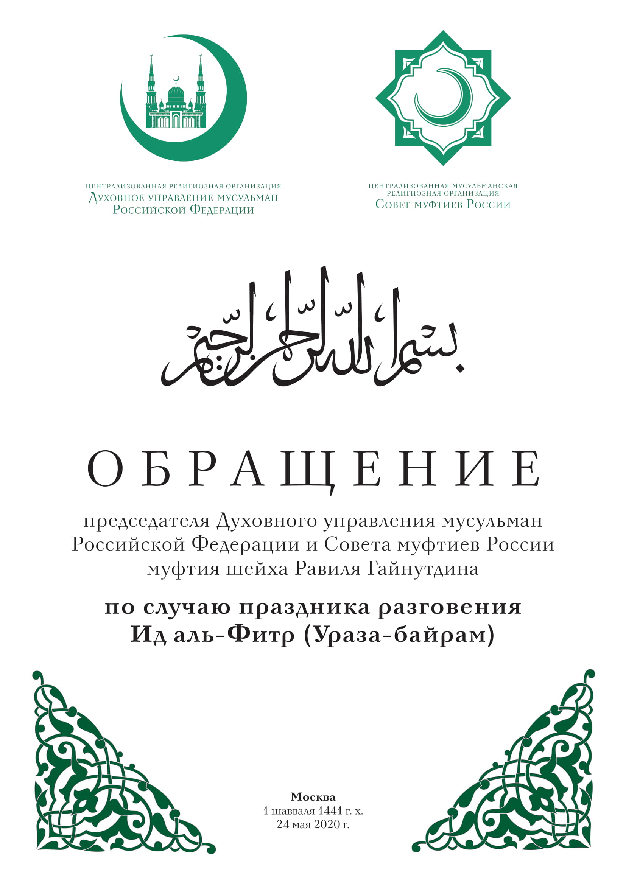
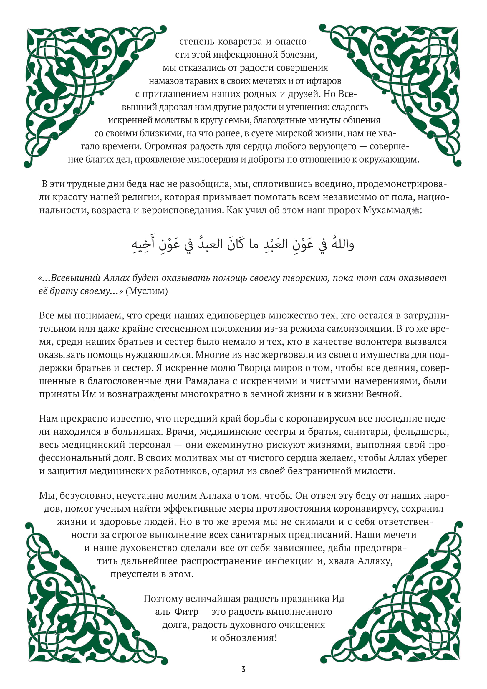
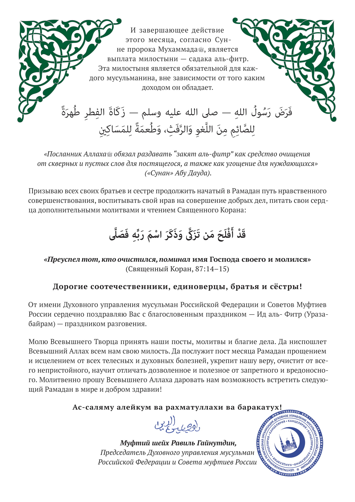
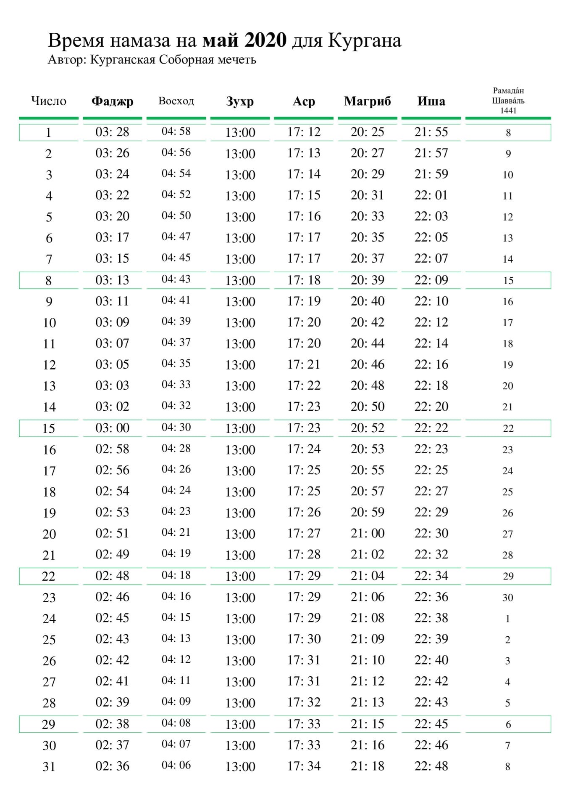
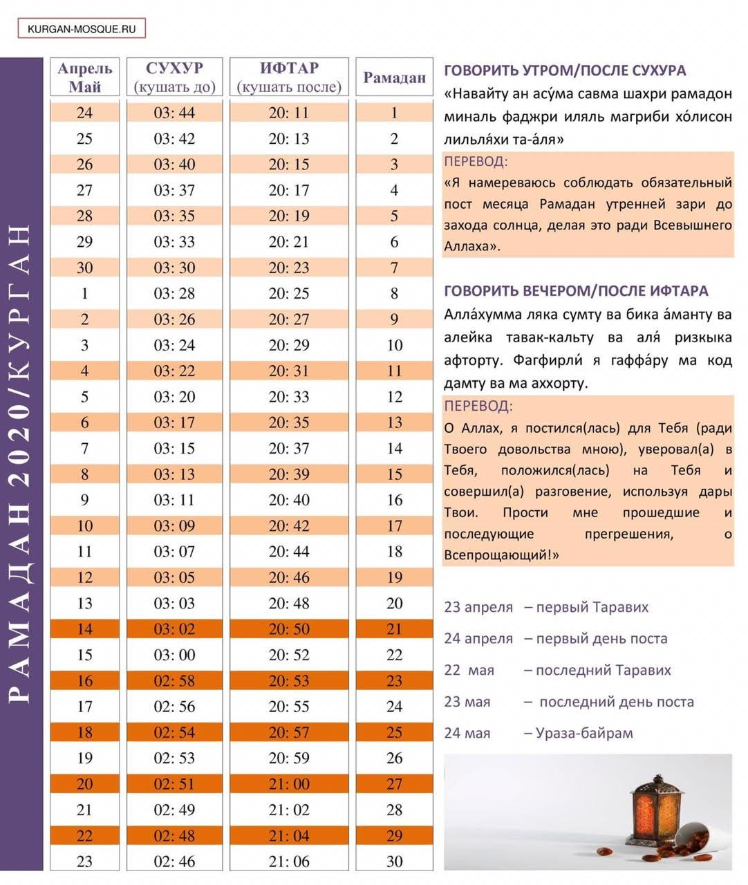
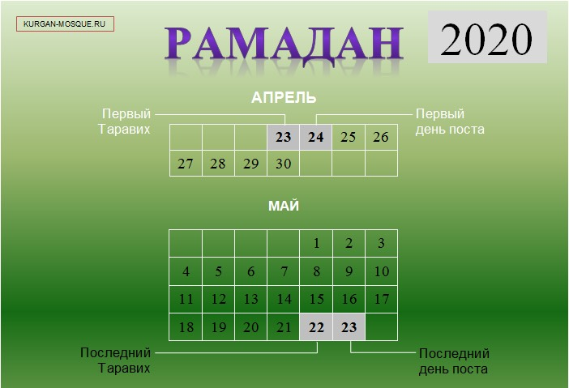
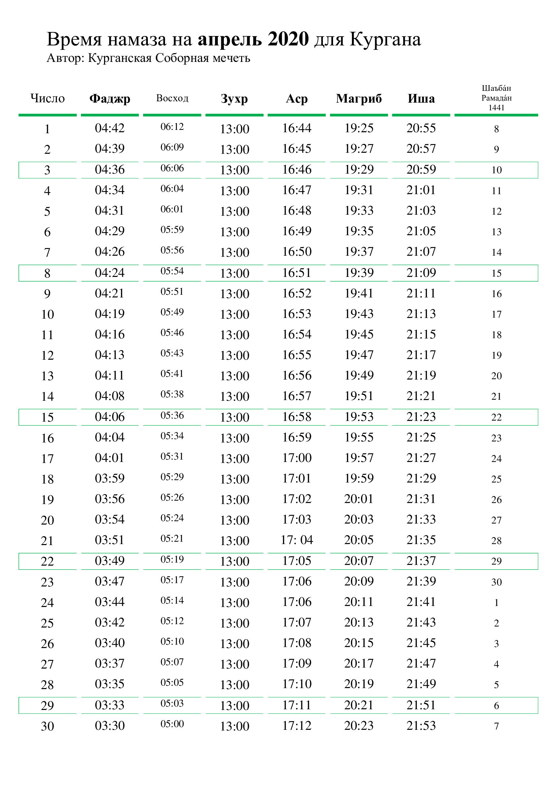

## Поздравление с наступлением праздника Ид аль Фитр (Ураза Байрам) 2020.

### Во имя Аллаха, милостивого и милосердного! Хвала Аллаху, Господу миров, мир и благословение Пророку Мухаммаду, а также его семье и всем его сподвижникам!

### Ассаляму алейкум ва рахмату-Ллахи ва баракатух!

Поздравляем всех мусульман Нашей общины с праздником Ид аль Фитр!

В течение всего месяца Рамадан верующие отказывались от еды, соблюдали духовную чистоту и увеличивали поклонение с верой и надеждой на прощение и милость Аллаха. ***Посланник Аллаха, Его милость Пророк Мухаммад (с.а.с.) говорил, что в этом месяце внимание Всевышнего обращено на человека: «Он ниспосылает особую милость, прощает грехи, принимает дуа. Всевышний смотрит на ваше рвение в хороших делах и гордится перед ангелами. Так покажите Аллаху свои хорошие поступки. Поистине, несчастен тот, кто даже в этом месяце лишился милости Всевышнего».***

Ураза Байрам – это праздник радости, счастья, улыбок, хорошего настроения. В первую очередь в этот день мусульмане обращаются к своему Господу – Всевышнему Аллаху с мольбой о том, чтобы Он принял их пост, все хорошие деяния и намерения, совершённые в этот месяц. Равно как для себя, так и для остальных мусульман мы просим того же, при встрече желаем этого и в ответ слышим «аминь», и надеемся, что Создатель по Своей милости примет наше богослужение.  Этот день наполнен глубочайшей верой со стороны верующих, поскольку праздничный день начинается с молитв, и весь день наполнен этой божественной милостью.

В этот день мы сердечно поздравляем всех мусульман, и обращаемся с мольбой к Милостивому: "О, Всевышний, прими все наши посты, молитвы и благие деяния!" И пусть Аллах приумножит воздаяния за ваши благие дела и поклонение многократно! Да сплотит и соберёт Аллах, как в этот Праздничный день всех нас Мусульман в Раю! Амин!

### Также, присоединяемся ко всем словам поздравления председателя ДУМ РФ и совета муфтиев России, муфтия шейха Равиля Гайнутдина.

***И в заключение: Хвала Аллаху – Господу миров!***

***Мир и благословение Аллаха нашему пророку Мухаммаду, членам его семьи и всем его сподвижникам!***

====================================================================================

## Время намаза на май 2020 года для Кургана

إِنَّ الصَّلَاةَ تَنْهَى عَنِ الْفَحْشَاءِ وَالْمُنكَرِ

**Воистину, намаз оберегает от мерзости и предосудительного (Куръан 29:45)**

Этот обряд поклонения (намаз) приносит человеку огромную пользу, и поэтому Всевышний Аллах возвестил о том, что намаз оберегает человека от мерзких поступков и предосудительного.

Мерзкими поступками называются отвратительные прегрешения, к которым человеческая душа испытывает природное влечение. А предосудительными деяниями являются прегрешения, которые не только порицаются разумом, но и противоречат природе человеческой души. И если человек регулярно совершает намаз, выполняя его обязательные предписания и проявляя смирение перед Господом, то ему непременно удастся избавиться от прегрешений любого рода.

Благодаря молитвам озарится светом его душа, очистится от скверны его сердце, приумножится его вера, усилится его стремление вершить добро и уменьшится или даже исчезнет его склонность к совершению грехов. Всякий, кто регулярно совершает намаз и выполняет его условия и обязательные предписания, непременно добьется этих результатов, потому что благочестие является одним из важнейших плодов мусульманской молитвы.

---

Чтобы прочитать обращение Шейха Равиля Гайнутдина, нажмите <a href="https://kurgan-mosque.ru/news">здесь</a>

### УСТАНОВКА ТОЧНОЙ ДАТЫ НАЧАЛА И ОКОНЧАНИЯ ПОСТА

Согласно лунному календарю, месяц Рамадан 2020 наступит с заходом солнца **23 апреля**. В этот день в 02.26 по всемирному координированному времени Луна вступит в невидимую фазу (иджтима). В этот же день в 17.43 по всемирному времени наступит фаза новолуния (ру’я), и Луна предположительно будет видна невооруженным глазом с западного побережья Северной и Южной Америки. Когда Луна перейдет из невидимой фазы в фазу новолуния, закат Луны произойдет на 23 минуты позже заката Солнца, и после заката Солнца серп Луны будет находиться в Мекке на 4.17 градусов, что является недостаточной высотой для фактической зримости Луны в Мекке. В пятницу, первый день Рамадана, соответствующий 24 апреля 2020 года, закат Луны в Мекке – на 1 час 14 минут позже заката Солнца, вследствие чего после заката Солнца серп Луны будет находиться в Мекке – на высоте 15.16 градусов над линией горизонта и будет виден невооруженным глазом.

***После пятой молитвы 23 апреля совершается первый Таравих – дополнительный намаз месяца Рамадан. Первым днем поста следует считать 24 апреля, последним же днем — 22 мая. Первый день месяца Шавваль и Ураза-байрам — 23 мая. Последний Таравих — 22 мая.***

22 мая 2020 года в пятницу, в 17.39 по всемирному времени наступит невидимая фаза Луны, а 23 мая 2020 года в субботу в 10.05 по всемирному времени наступит фаза новолуния, и лунный серп предположительно будет виден из Северной Африки и Южной Америки. В субботу 23 мая 2020 года, который является датой невидимой фазы Луны (иджтима), молодой месяц закатится в Мекке, на 44 минуты позже Солнца. В момент заката Солнца Луна будет в Мекке на 8.24 градусов выше линии горизонта, что является достаточной высотой для фактической зримости Луны. В воскресенье 24 мая 2020 года, соответствующего 1 дню Шавваля, Луна в Мекке закатится на 1 час 39 минут позже Солнца, вследствие чего в момент заката Солнца лунный серп будет находиться в Мекке – на 19.56 градусов выше линии горизонта. 24 мая 2020 года станет первым днем праздника Ураза-байрам.

В вопросе о точной дате начала месяца поста аксиомой является ежегодное официальное решение мусульманских руководителей в том или ином регионе. Например, в отдельных государствах население заблаговременно информируют о начале священного месяца. Данное решение основывается на астрономических расчетах, дающих достаточную точность.

Людям необходимо следовать тому, что скажут местные религиозные руководители. В Священном Коране говорится: ***“Будьте покорны Всевышнему, [назиданиям] Пророка и [будьте солидарны в благом с] вашими руководителями” (см. Св. Коран, 4:59)***. Пророк Мухаммад (да благословит его Всевышний и приветствует) говорил: ***“Имам у вас для того, чтобы следовать ему”.***

Сегодня, как и многими веками ранее, часто применяется заблаговременный астрономический расчет начала и конца лунного месяца, что очень практично.

Известно, что в нашей религии лунный календарь служит основой для определения времени важнейших религиозных обрядов, таких как пост, паломничество, садакатуль-фитр, Ураза-байрам, Курбан-байрам и др. Согласно установлениям религии, лунный месяц начинается после полного убывания последней лунной фазы, когда на небосклоне появляется новая луна (новолуние) или с наблюдением новой луны над горизонтом после захода солнца. Завершается лунный месяц также с появлением луны. Основой для этого является хадис посланника Аллаха: ***“Поистине, Всевышний сотворил луну для людей, чтобы они определяли время. Так поститесь же, когда увидите новую луну (новолуние Рамадана), и празднуйте (Уразу-байрам), когда снова увидите луну (новолуние Шавваля)”.***

В определении лунных месяцев, согласно требованиям нашей религии, Совет улемов ДУМ РФ опирается на итоги международной конференции “Руятуль хиляль” (Наблюдение Новолуния), прошедшей с 27 по 30 ноября 1978 года в Стамбуле, беря за основу критерии, выведенные в соответствии с научными и религиозными фактами. Многие мусульманские страны также следуют этим критериям.

За основу взят лунный календарь на нынешний, 1441-й год по хиджре, выведенный в соответствии с научными и религиозными фактами, с применением современных технологий, который опубликован на официальном сайте Управления по делам религии Республики Турция.

***Выдержка из БОГОСЛОВСКОГО ЗАКЛЮЧЕНИЯ № 3/20 Совета улемов ЦРО ДУМ РФ.***

__________________________________________________________________________________________________________________________________

## Время намаза на апрель 2020 года / Курган

**إِنَّ الصَّلَاةَ كَانَتْ عَلَى الْمُؤْمِنِينَ كِتَابًا مَّوْقُوتًا**

Поистине, молитва для верующих – предписана [сделана обязательной] (для совершения) в установленное время (Куръан 4:103)

## Уведомление о приостановке коллективных молитв в Курганской Соборной мечети

***В связи с угрозой распространения коронавирусной инфекции (COVID-19)***, учитывая высокую степень опасности этого заболевания, в соответствии с установлениями религии Ислам, руководствуясь богословским заключением Совета улемов (учёных) Духовного управления мусульман РФ No 1/20 от 17.03.2020 года, в Курганской Соборной мечети приостанавливается проведение коллективных пятикратных и пятничных молитв.

**Приостанавливается также практика проведения маджлисов, никахов и имянаречения с участием большого количества людей.**
Ввиду невозможности отложить проведение погребальных обрядов и джаназа-намаза, предписывается проводить обряды с минимальным количеством людей.

**Рекомендуется воздерживаться от традиционного приветствия через рукопожатия и объятия.**
Приведенные правила подлежат исполнению со дня публикации, и прекращают своё действие после специального извещения, которое также будет доведено до уммы.

***Руководство Курганской Соборной мечети***

