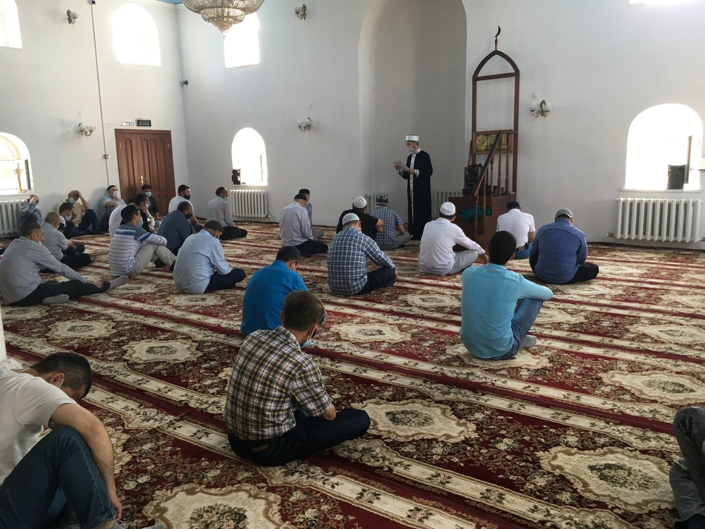
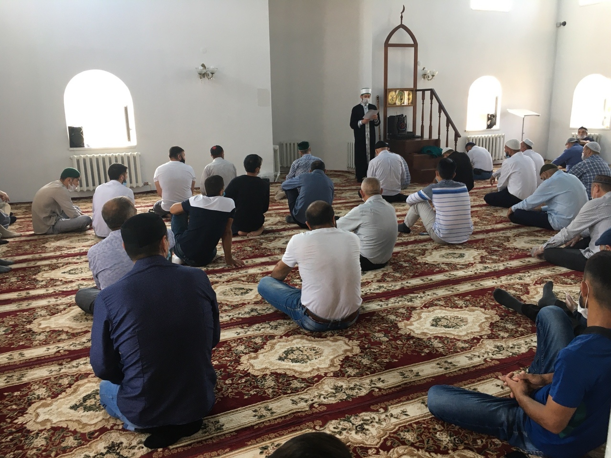

**_И служите (и поклоняйтесь) (только) (одному) Аллаху и не придавайте Ему никого в соучастники [никого, кроме Него, не обожествляйте], и к родителям (проявляйте искреннее)
благодеяние (словами, делами, имуществом,...), и (также) к родственнику [родственникам], и к сиротам, и к беднякам, и соседу, который является родственником, и соседу,
(который не является родственником), и спутнику (в пути) (который) рядом, и (нуждающемуся) путнику, и тем, которыми овладели десницы ваши [вашим невольникам].
Поистине, Аллах не любит тех, кто горделив [высокомерных](и) хвастлив._** (Куръан, 4:36)

Аллах повелевает поклоняться Ему Единому без сотоварищей. Ведь именно Он является Создателем, Дающим удел, Дарующим блага Своим творениям во всех ситуациях и во все времена.
Он достоин того, чтобы они поклонялись Ему Одному не приобщая к Нему сотоварищей из числа Его творений.

Пророк (да благословит его Аллах и приветствует) сказал Муазу ибн Джабалу: **_"О Муаз, известно ли тебе, какое право Аллаха должны соблюдать рабы Его, и чего они вправе (ожидать)
от Аллаха?"_** Я сказал: **_"Аллах и Его посланник знают об этом лучше"_**. (Тогда) он, (да благословит его Аллах и приветствует) сказал: **_"Поистине, право Аллаха, которое
обязаны соблюдать рабы Его, состоит в том, что им следует поклоняться одному только Аллаху. Знаешь ли ты, какого право рабов, если они выполнят это? Рабы вправе ожидать, что
Аллах не станет подвергать мучениям того, кто не поклоняется никому, кроме Него"_**. (Аль-Бухари; Муслим)

Затем Аллах завещал делать добро родителям, ведь Аллах сделал их причиной твоего появления на свет из небытия. Аллах многократно сочетает поклонение Ему с благодеянием
родителям. Так, например, Он сказал: **_"Благодари Меня и своих родителей"_** (Куръан, 31:14) а также: **_"Твой Господь предписал вам не поклоняться никому, кроме Него и делать
добро родителям"_** (Куръан, 17:23). Затем Аллах связал благодеяние родителям с благодеянием по отношению к мужчинам и женщинам из числа родственников. Как говорится в хадисе:
**_"Милостыня бедняку – просто милостыня, а милостыня родственнику – милостыня и поддержка родственных уз"_**.

Затем Аллах сказал: **_"Сиротам – за то, что у них нет никого, кто отстаивал бы их интересы и расходовал на них."_** Затем Он сказал: **_"Беднякам – тем, которые не могут
покрыть расходы на свои нужды. Аллах повелел оказывать им помощь, дабы закрыть их нужды."_**

Затем Аллах сказал: **_"И соседу близкому по родству, и соседу чужому"_**.

Посланник Аллаха (да благословит его Аллах и приветствует) сказал: **_"Джибрил не прекращал давать мне наставления о необходимости хорошего отношения к соседу (так долго), что
я даже подумал, что он включит его [Подразумевается, что всё это Джибрил (мир ему) делал по велению Аллаха] и в число наследников"_**. (Аль-Бухари; Муслим). Посланник Аллаха
(да благословит его Аллах и приветствует) сказал: **_"Наилучшим другом перед Аллахом будет наилучший по отношению к своему другу, а наилучшим соседом – наилучшим по отношению
к своему соседу"_**. (Ахмад 167/2, сохих)

Слово Аллаха: **_"и тому, чем овладели десницы ваши"_** – это завещание по поводу невольников, ведь невольник слаб уже потому, что он находится под властью людей.
Посланник Аллаха (да благословит его Аллах и приветствует) сказал: **_"Поистине, (ваши рабы) являются вашими братьями и вашими слугами, которых Аллах сделал подвластными вам,
так пусть же тот, кто владеет братом своим, кормит его тем же, что ест сам, и одевает его в то же, что носит сам, и не поручайте им ничего непосильного для них, а если
поручите, то оказывайте им помощь!"_** (Аль-Бухари; Муслим)

Слово Аллаха: **_"Аллах не любит гордецов и бахвалов"_** – т.е. самолюбивых высокомерных гордецов, которые считают людей ниже себя, себя же они ставят выше всех, хотя перед
Аллахом они презренны и ненавистны людьми. Пророк Мухаммад (да благословит его Аллах и приветствует) как-то сказал: **_"Не войдет в Рай тот, в сердце которого есть хоть малая
частица высокомерия"_** . Его спросили: "А если [например] человек любит хорошо одеваться, носить красивую обувь?» Он (да благословит его Аллах и приветствует) ответил:
**_"Воистину, Аллаху присуще лишь красивое (изящное, совершенное), и Он любит красоту. [То есть любовь человека к красоте, к чему-то изящному, хорошему, аккуратному не есть
проявление гордости, надменности]. Высокомерие — это неприятие правды (упрямое несогласие с тем, что очевидно) и пренебрежительное отношение к людям [вне зависимости от того,
какой они национальности или вероисповедания]"_**. (Муслим)
