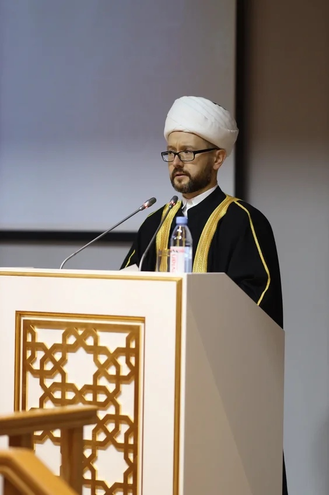

Имам-хатыб Мемориальной мечети Москвы, председатель Совета улемов Духовного управления мусульман Российской Федерации ****Шамиль-хазрат Аляутдинов**** представил доклад о 
деятельности Совета улемов перед пленумом организации 23 сентября 2020 г. в Московской Соборной мечети.

Вот уже несколько лет Совет улемов ДУМ РФ активно ведет свою работу. Он является коллегиальным совещательным органом, созданным с целью решения научно-богословских вопросов. 
В своей деятельности Совет руководствуется принципами Корана и Сунны, мнением авторитетных ученых-правоведов четырех правовых школ (мазхабов), нормами традиционной религиозной 
практики мусульман России, законодательством РФ и Уставом ДУМ РФ.

Основными задачами Совета являются:
подготовка религиозно-правовых заключений (фетв) по возникшим современным вопросам;
проведение ежеквартальных заседаний с участием всех членов Совета для обсуждения и принятия решений по религиозно-правовым заключениям (фетвам);
взаимодействие с международными организациями по изданию фетв.

Заседания Совета улемов традиционно проходят два дня.
В первый день члены Совета обогащают свой багаж знаний, принимая участие в лекциях зарубежных ученых-богословов с мировым именем, специалистов по изданию фетв. Так, например, 
в этом году с лекцией выступили: (1) Председатель совета по фетвам Палестины, доктор шариатских наук, шейх Машхур Фаваз, (2) Заместитель генерального секретаря Европейского 
совета по фетвам и исследованиям, доктор шариатских наук, шейх Халид Ханафи, (3) Советник муфтия Египта по изданию фетв, доктор шариатских наук Магди Ашур (4) Профессор, ректор 
Исламского университета в штате Миннесота, член комитета по изданию фетв США Абдуль-ʻАзиз аль-Муниси, (5) Профессор, доктор коранических наук, член Международного союза 
мусульманских ученых Сафват Мустафа Халилович. Некоторые из них приняли участие в обсуждении принимаемых нами фетв.
Во второй день заседания члены Совета улемов знакомятся с заранее подготовленными подробными богословскими исследованиями и принимают по ним наиболее выверенные, подходящие 
российским реалиям решения.

****За год были подробно исследованы и приняты решения по следующим вопросам:****
1. Порядок захоронения умерших от covid-19.
2. Соблюдение поста в условиях пандемии covid-19.
3. Совершение Джума-намаза в условиях пандемии.
4. Расторжение брака в случае принятия супругой ислама.
5. Развод в порыве гнева.
6. Праздник жертвоприношения “Курбан-байрам 2020”.
7. Обусловленный развод (талак му‘алляк).
8. Заключение мусульманского брака без согласия опекуна.
9. Механический убой птицы.
10. Межконфессиональные браки.
11. Свадебный подарок (махр).
12. Развод-нововведение.

****К концу года планируется принятие решений еще по 2 вопросам:****
1. Многоженство в Исламе в условиях РФ.
2. Определение начала и окончания времени поста в месяц Рамадан (астрономический или традиционный подход в определении).

Хотелось бы отметить, что в заседаниях Совета принимали участие не только члены Совета улемов, но и представители ДУМ, не входящих в состав ДУМ РФ (представители ДУМ 
Татарстана, Дагестана, Казахстана, Кыргызстана и Белоруссии).

Следует отметить, что Совет улемов ДУМ РФ изучает опыт авторитетных международных организаций по изданию фетв, но выносит лишь те решения, которые соответствуют нашей 
российской действительности.
Особое внимание хотелось бы обратить на то, что фетвы Совета не являются про-арабскими, про-турецкими или про-европейскими, они чисто российские. Любой вопрос изучается 
достаточно глубоко, приводится подробная аргументация каждой из сторон, поддерживающей то или иное мнение. Совет выбирает то мнение, которое соответствует мнению богослов 
прошлых столетий, но в то же время учитывается сегодняшняя действительность, в которой живут мусульмане России.

23 сентября 2020 г., Московская Соборная мечеть

https://youtu.be/kiNaw8FvxuY
