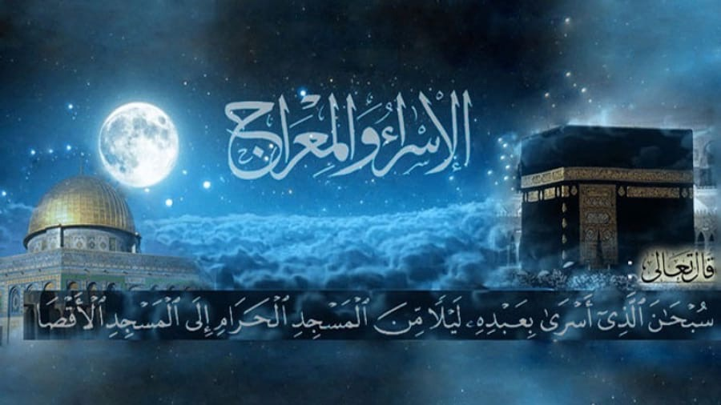

**По мнению большинства учёных, в ночь с 26 на 27 числа месяца Раджаб произошло событие "Лейлятуль Исра валь Миърадж".**

**В этом году "Лейлятуль Исра валь Миърадж" приходиться на ночь с 10 на 11 марта.**

В Куръане говорится следующее: «Пречист Тот, Кто перенес ночью Своего раба, чтобы показать ему некоторые из Наших знамений, из Заповедной мечети в мечеть аль-Акса, окрестностям 
которой Мы даровали благословение. Воистину, Он - Слышащий, Видящий.» (Куръан, 17:1)

Всевышний подчеркнул свое совершенство и величие, проявлениями которого являются Его великие деяния и величественные милости. Одним из таких деяний является ночной перенос 
Пророка Мухаммада из Заповедной мечети в Мекке, самой славной мечети на свете, в мечеть аль-Акса в Иерусалиме, которая также является одной из самых достойных мечетей и 
пристанищем пророков.

В течение одной ночи Пророк Мухаммад, да благословит его Аллах и приветствует, преодолел очень большое расстояние и той же ночью вернулся обратно. Аллах показал ему знамения, 
которые усилили его приверженность прямому пути и приумножили его познания, научили его стойкости и способности отличать добро от зла. Это было еще одним проявлением божественной заботы о Пророке Мухаммаде, которому Аллах всесторонне облегчил достижение желанной цели и даровал удивительные качества, благодаря которым он превзошел всех своих 
предшественников и современников.

Опираясь на очевидный смысл этого аята, можно предположить, что Пророк Мухаммад, да благословит его Аллах и приветствует, отправился в далекое путешествие в первые часы ночи и 
что он отправился в путь непосредственно из Заповедной мечети. Однако в достоверном хадисе сообщается, что он отправился в путь из дома Умм Хани. А это значит, что преимущества 
Заповедной мечети распространяются на всю заповедную мекканскую землю. И если человек поклоняется на заповедной мекканской земле, то его вознаграждение приумножается, как если 
бы он поклонялся внутри Заповедной мечети. Из этого аята также следует, что Пророк Мухаммад, да благословит его Аллах и приветствует, отправился в путешествие как душой, так и 
телом. В противном случае это путешествие не было бы величайшим знамением и достоинством.

О ночном путешествии Пророка сообщается во многих достоверных хадисах, в которых перечисляются многочисленные знамения, показанные ему. Из этих хадисов известно, что вначале он 
отправился в священный город Иерусалим, откуда вознесся на небеса. Он поднялся до вершины седьмого неба, где ему были показаны Рай и Преисподняя. На каждом из небес он встречался с пророками, а затем ему было предписано ежедневно совершать пятьдесят обязательных намазов. По наставлению пророка Мусы он несколько раз просил Аллаха облегчить обязанности его последователей, пока Аллах не уменьшил число обязательных ежедневных намазов до пяти. А всякому, кто будет совершать эти пять намазов, было обещано вознаграждение за пятьдесят намазов.

В эту ночь Пророку Мухаммаду и его последователям было даровано столько достоинств, что исчислить их может только великий и могучий Аллах. В этом откровении и других аятах, 
в которых Аллах говорит о ниспослании Корана или предлагает многобожникам сочинить нечто подобное ему, Аллах называет Пророка Мухаммада, да благословит его Аллах и приветствует, 
Своим рабом, поскольку он достиг величайших высот именно благодаря тому, что исправно выполнял обязанности раба перед своим Господом.

В этом откровении также говорится о том, что земли вокруг мечети аль-Акса являются благодатными. Там растет множество деревьев, течет множество рек и ручьев, а урожаи всегда 
бывают богатыми. Еще одним преимуществом этой земли является сама мечеть аль-Акса, которая превосходит все мечети на земле, кроме Заповедной мечети и мечети Пророка в Медине. 
Аллах предписал правоверным отправляться в путешествие с целью посетить эту мечеть и совершить в ней намаз. Аллах также избрал эту землю местом обитания для славной плеяды 
Своих пророков и избранников.
