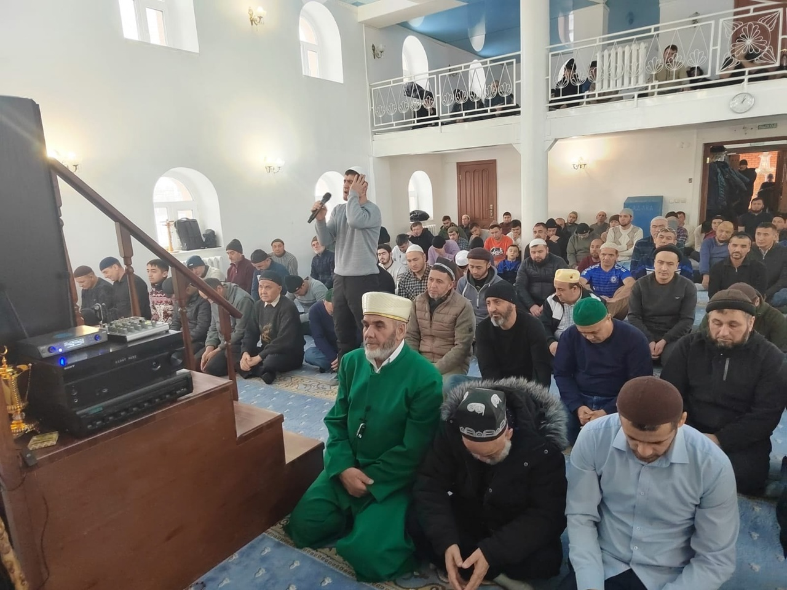

Ассаляму алейкум ва рахматуллахи ва баракятух уважаемые братья и сестры.

24 января в Курганской Соборной мечети состоялись пятничная хутба и джума намаз. Зиёдали Курбонович в своей проповеди рассказал о 
событиях которые произошли с нашим Пророкомﷺ в Ночь Вознесения (Ляйлятуль Ми'радж).

قال الله سبحانه وتعالى

سُبْحَٰنَ ٱلَّذِىٓ أَسْرَىٰ بِعَبْدِهِ ۦ لَيْلًا مِّنَ ٱلْمَسْجِدِ ٱلْحَرَامِ إِلَى ٱلْمَسْجِدِ ٱلْأَقْصَا ٱلَّذِى بَٰرَكْنَا حَوْلَهُ ۥ لِنُرِيَهُ ۥ مِنْ ءَايَٰتِنَآ ۚ

إِنَّهُ ۥ هُوَ ٱلسَّمِيعُ ٱلْبَصِيرُ

"Пречист Тот, Кто перенес ночью Своего раба, чтобы показать ему некоторые из Наших знамений, из Заповедной мечети в мечеть аль-Акса, 
окрестностям которой Мы даровали благословение. Воистину, Он - Слышащий, Видящий." сура Аль-Исра, 1 аят.

Исра – путешествие Пророкаﷺ из мекканской мечети аль-Харам в мечеть аль-Акса в аль-Кудсе (Иерусалим). Ми‘радж – 
последовавшее за этим вознесение Посланникаﷺ на небо и достижение того места, о котором нет знания ни у ангелов, ни у джиннов, ни у людей.
Исра и Мирадж – одна из важных дат для мусульман. По исламскому лунному календарю Ночь путешествия и вознесения принято отмечать с 26 на 
27 число месяца Раджаб. В 2025 году Исра и Мирадж выпадает на ночь с 26 на 27 января.
