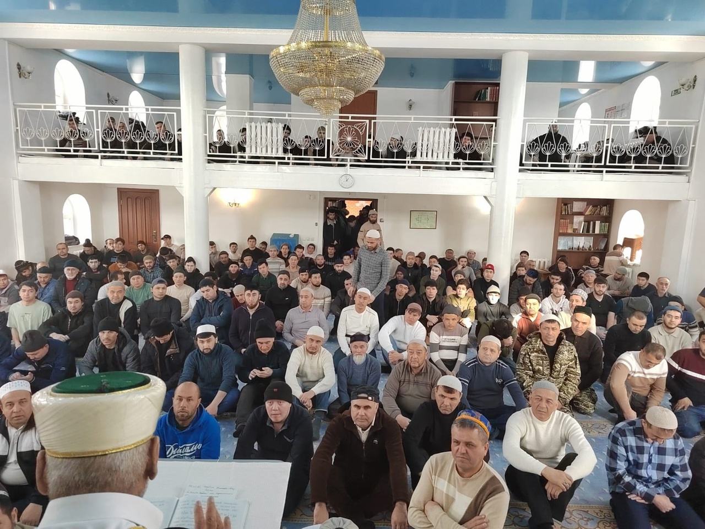

Ассаляму алейкум ва рахматуллахи ва баракятух уважаемые братья и сестры. Сегодня, 28 февраля в Курганской Соборной мечети состоялась хутба на тему: "Рамадан - месяц поста, Корана, Милости и Милосердия Всевышнего".

Зиёдали Курбонович рассказал в своей проповеди о Священном месяце Рамадане, напомнил о важных особенностях поста и поклонения в этом месяце, прочитал аяты и хадисы касающиеся благословенного Рамадана.

"Уважаемые братья и сестры! Поздравляю вас с наступлением Священного месяца Рамадан.
28 февраля с заходом солнца начинается обязательный пост, который является одним из столпов Ислама. Рамадан, месяц в который был ниспослан Коран.

Аллах Субханаху Ва Та'аля говорит в Коране:

"شَهْرُ رَمَضَانَ ٱلَّذِىٓ أُنزِلَ فِيهِ ٱلْقُرْآنُ هُدًى لِّلنَّاسِ وَبَيِّنَٰتٍ مِّنَ ٱلْهُدَىٰ وَٱلْفُرْقَانِ ۚ فَمَن شَهِدَ مِنكُمُ ٱلشَّهْرَ فَلْيَصُمْهُ

"В месяц Рамадан был ниспослан Коран - верное руководство для людей, ясные доказательства из верного руководства и различение. Тот из вас, кого застанет этот месяц, должен поститься." сура Бакара, 185 аят.

Пост - это поклонение, которое требует большого терпения, Аллах Субханаху Ва Та'аля сказал:

إِنَّمَا يُوَفَّى ٱلصَّٰبِرُونَ أَجْرَهُم بِغَيْرِ حِسَابٍ

".. Воистину, терпеливым их награда воздастся полностью без счета" сура Аз-Зумар, 10 аят.

Всевышний Аллах увеличил награду поклоняющихся из общины Мухаммадаﷺ по сравнению с другими общинами, поскольку Он почтил и возвысил ее:

كُنتُمْ خَيْرَ أُمَّةٍ أُخْرِجَتْ لِلنَّاسِ تَأْمُرُونَ بِٱلْمَعْرُوفِ وَتَنْهَوْنَ عَنِ ٱلْمُنكَرِ وَتُؤْمِنُونَ بِٱللَّهِ ۗ وَلَوْ ءَامَنَ أَهْلُ ٱلْكِتَٰبِ لَكَانَ خَيْرًا لَّهُم ۚ مِّنْهُمُ ٱلْمُؤْمِنُونَ وَأَكْثَرُهُمُ ٱلْفَٰسِقُونَ

"Вы являетесь лучшей из общин, появившейся на благо человечества, повелевая совершать одобряемое, удерживая от предосудительного и веруя в Аллаха.." сура Али Имран, 110 аят.

Мы должны встречать Рамадан так, словно мы встречаем его в последний раз, и стараться получить от этой встречи как можно больше. Пророкﷺ говоря о Рамадане, радовал сподвижников, и они ждали этот месяц с нетерпением - ведь каждый его миг наполнен милостью от Всевышнего.
Пророкﷺговорил:

قد جاءكم رمضان شهر مبارك افترض الله عليكم صيامه تفتح فيه أبواب الجنة وتغلق فيه أبواب الجحيم وتغل فيه الشياطين فيه ليلة خير من ألف شهر من حرم خيرها فقد حرم

«Пришёл к вам Рамадан, благословенный месяц, в котором Аллах предписал вам пост, в нем отворяются врата Рая, запираются врата Ада, и заковываются шайтаны, и в нем ночь - которая лучше тысячи месяцев, и кто лишился его блага - тот лишился всего».

Поистине, пост - это площадь для состязающихся в степени богобоязненности. Они используют дни и ночи Рамадана для того, чтобы увеличить свою веру, укрепить свой иман. Их пробуждает к этому вера в Аллаха и надежда получить Его награду за это поклонение.

Я сердечно поздравляю всех мусульман с началом Священного месяца Рамадан.

Пусть Всевышний ниспошлёт вам свою милость и милосердие.

Пусть Аллах укрепит наши сердца, дарует нам терпение и стойкость, спокойствие и благополучие.

Да поможет нам Аллах, и да сделает Он этот Рамадан - средством наставления нас на прямой путь."

Альхамдулилях, также есть хорошие новости, мусульмане Курганской Соборной мечети перед началом Священного месяца собрали 50 тысяч рублей, в помощь на СВО.

И напоминаем, что каждую ночь месяца Рамадан в Курганской Соборной мечети будет проводиться коллективная молитва таравих, по адресу: Сибирская 2а.

Да пребудет над вами мир милость и Благословение Аллаха, да дарует Всевышний всем нам стойкость и смирение в этом месяце.
