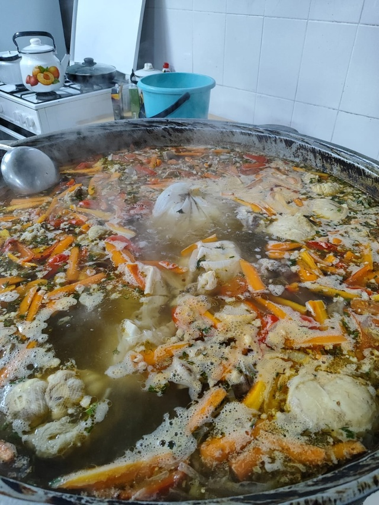
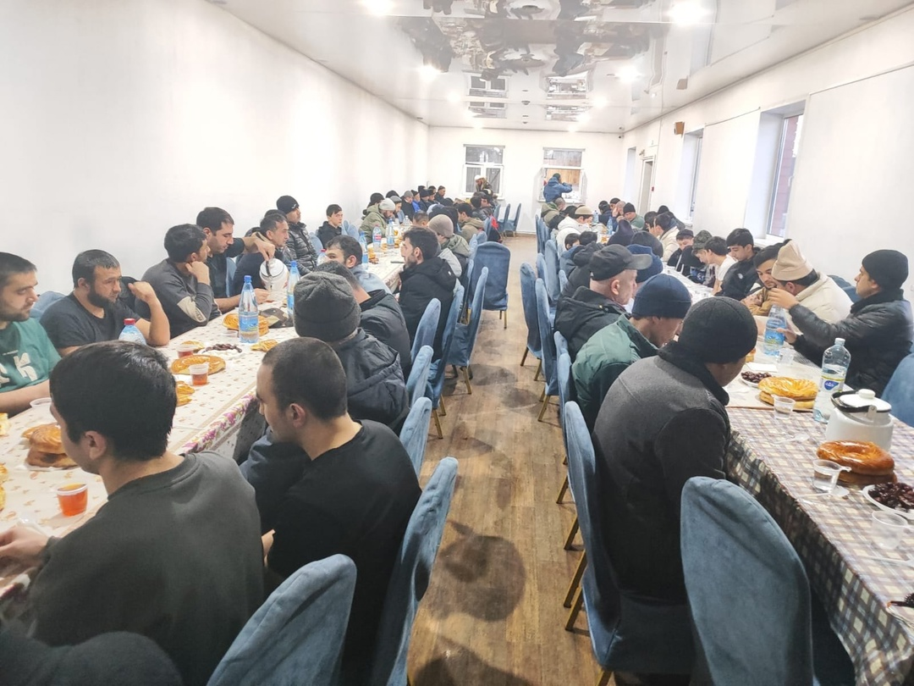

Ассаляму алейкум ва рахматуллахи ва баракятух уважаемые братья и сестры.

Альхамдулиллях, 2 марта в Курганской Соборной мечети прошёл ифтар.

عَنْ زَيْدِ بْنِ خَالِدٍ الجُهَنِيِّ قَالَ: قَالَ رَسُولُ اللَّهِ صَلَّى اللَّهُ عَلَيْهِ وَسَلَّمَ: «مَنْ فَطَّرَ صَائِمًا كَانَ لَهُ مِثْلُ أَجْرِهِ، غَيْرَ أَنَّهُ لَا يَنْقُصُ مِنْ أَجْرِ الصَّائِمِ شَيْئًا»: «هَذَا حَدِيثٌ حَسَنٌ صَحِيحٌ»

Сообщается, что Зейд ибн Халид аль-Джухани (да будет доволен им Аллах) сказал: «Посланник Аллаха ﷺ сказал: 

“Накормивший постящегося (при разговении) получит такую же награду, как и сам он, но при этом награда (постящегося) не уменьшится ни на йоту”».
  
  
