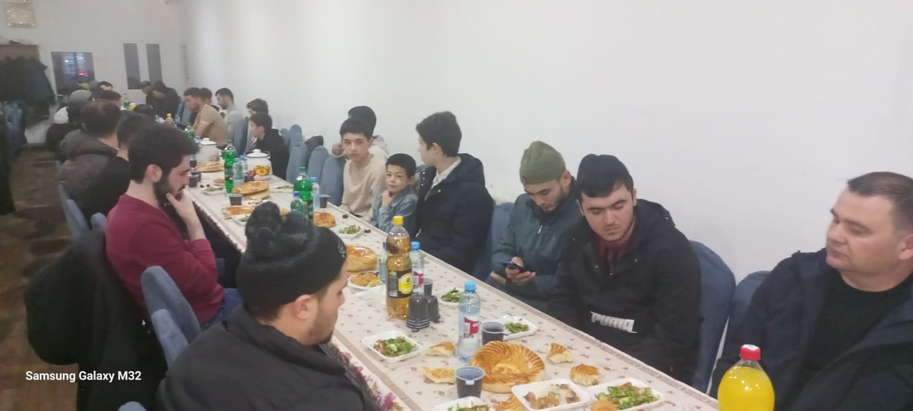
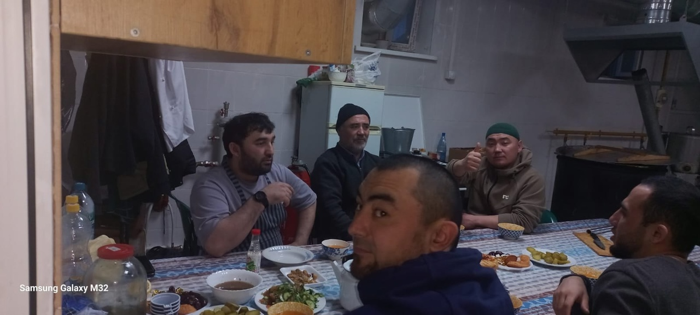

---
title:
---

17 марта прошёл ифтар в Курганской Соборной мечети. Альхамдулилях, Хвала Аллаху, Господу миров за возможность проводить ифтары, готовить 
вкусные блюда для разговения. Пусть Аллах дарует баракят тем кто накрывает на столы, помогает и принимает участие.

قال الله سبحانه وتعالى

إِنَّمَا ٱلصَّدَقَٰتُ لِلْفُقَرَآءِ وَٱلْمَسَٰكِينِ وَٱلْعَٰمِلِينَ عَلَيْهَا وَٱلْمُؤَلَّفَةِ قُلُوبُهُمْ وَفِى ٱلرِّقَابِ وَٱلْغَٰرِمِينَ وَفِى سَبِيلِ ٱللَّهِ وَٱبْنِ ٱلسَّبِيلِ ۖ فَرِيضَةً مِّنَ ٱللَّهِ ۗ وَٱللَّهُ عَلِيمٌ حَكِيمٌ

"Пожертвования предназначены для неимущих и бедных, для тех, кто занимается их сбором и распределением, и для тех, чьи сердца хотят 
завоевать, для выкупа рабов, для должников, для расходов на пути Аллаха и для путников. Таково предписание Аллаха. Воистину, Аллах - 
Знающий, Мудрый." сура Ат-Тауба, 60 аят.

Пророк Мухаммадﷺ сказал: «Поистине, мольба постящегося [обращенная к Аллаху] во время разговения, не будет отвергнута».

