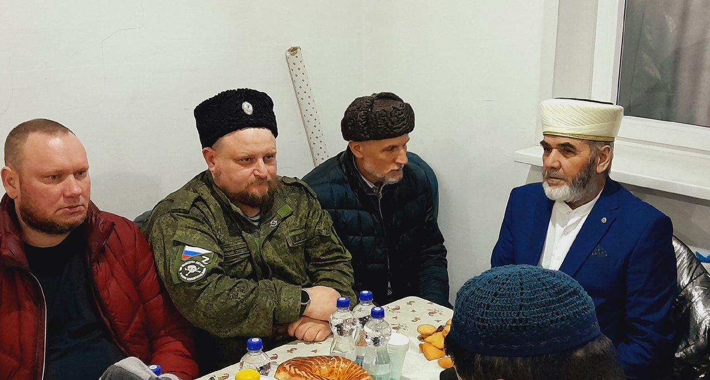
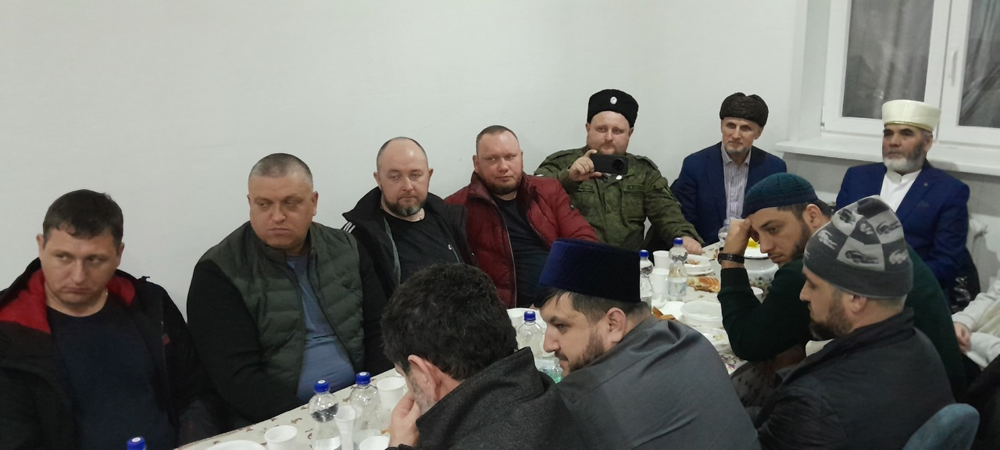
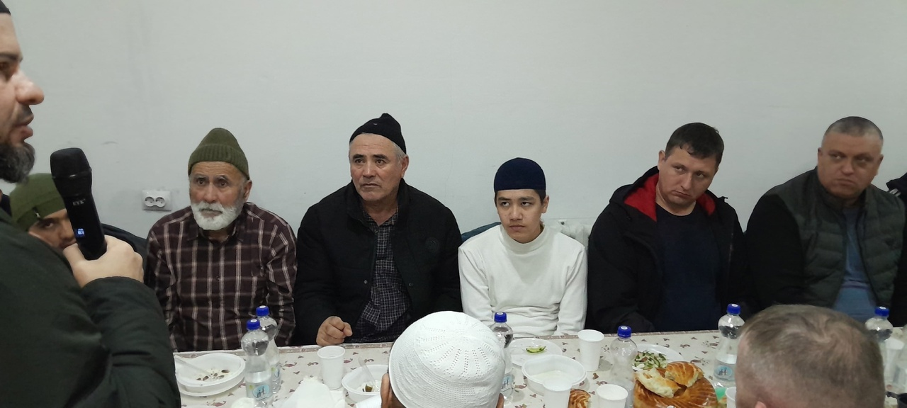
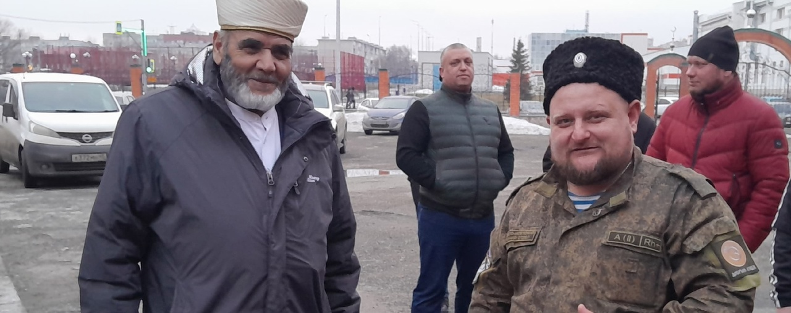
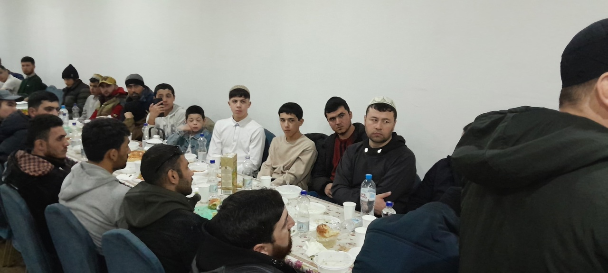
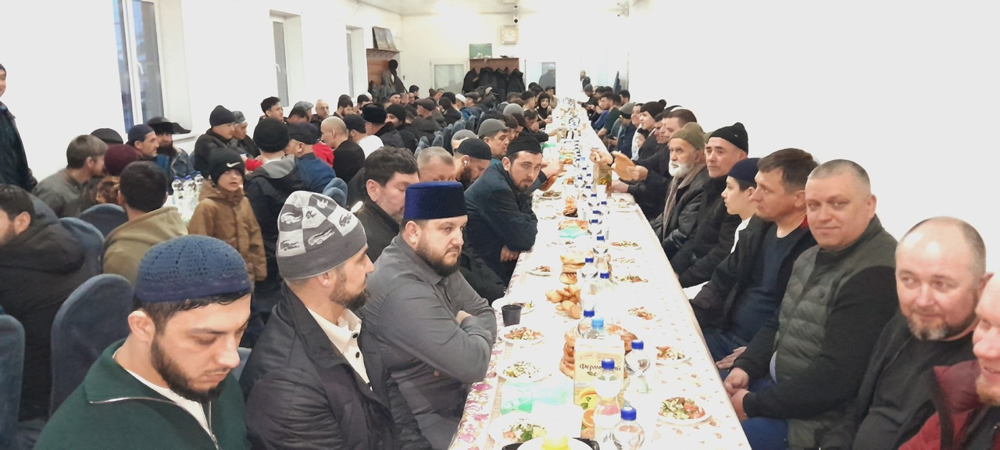

Ассаляму алейкум ва рахматуллахи ва баракятух уважаемые братья и сестры.

19 марта в Курганской Соборной мечети братья казаки организовали ифтар на 170 человек.

قال الله سبحانه وتعالى

وَلَا تَعَاوَنُوا عَلَى ٱلْإِثْمِ وَٱلْعُدْوَٰنِ ۚ وَٱتَّقُوا ٱللَّهَ ۖ إِنَّ ٱللَّهَ شَدِيدُ ٱلْعِقَابِ

Аллах Субханаху Ва Та'аля говорит в Священном Кур'ане:

"..Помогайте друг другу в благочестии и богобоязненности, но не помогайте друг другу в грехе и посягательстве. Бойтесь Аллаха, ведь 
Аллах суров в наказании.", сура Аль-Маида, 2 аят.

Пророкﷺ сказал:

كُلُّ مَعْرُوفٍ صَدَقَةٌ

«Всякое благодеяние является пожертвованием (милостыней)».

"От имени Курганской Соборной мечети и от себя лично хотим выразить благодарность Александру Пылкову, всем нашим братьям казакам, а также 
гостям из Дагестана. Мы живём в многонациональной стране, поэтому должны поддерживать друг друга и помогать друг другу. ИншаАллах мы и 
дальше будем поддерживать тёплые отношения, и работать вместе."

С уважением, имам Курганской Соборной мечети Зиёдали Курбонович Мизробов.
