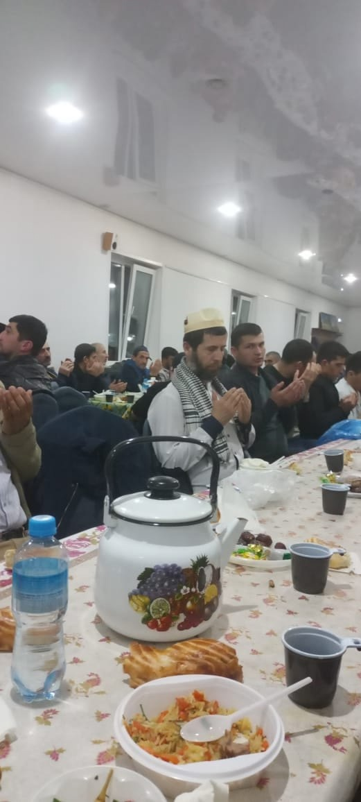
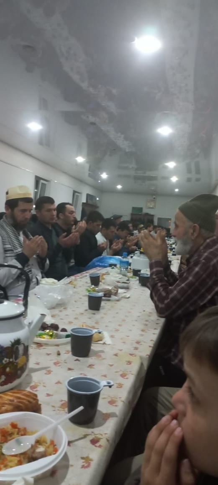

25 марта в Курганской Соборной мечети братья таджики провели ифтар.

Посланник Всевышнегоﷺ сказал: «У постящегося есть две радости: одна при разговении, вторая при встрече со своим Господом» (Бухари).

Пусть Аллах Субханаху Ва Та'аля примет наши посты, молитвы и благие деяния.
